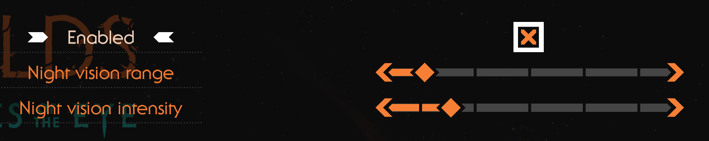
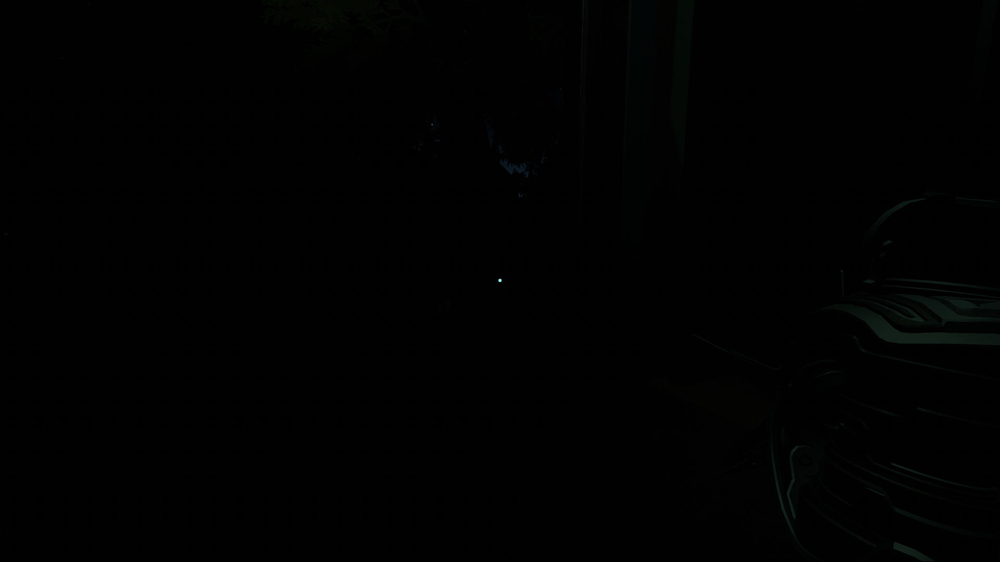
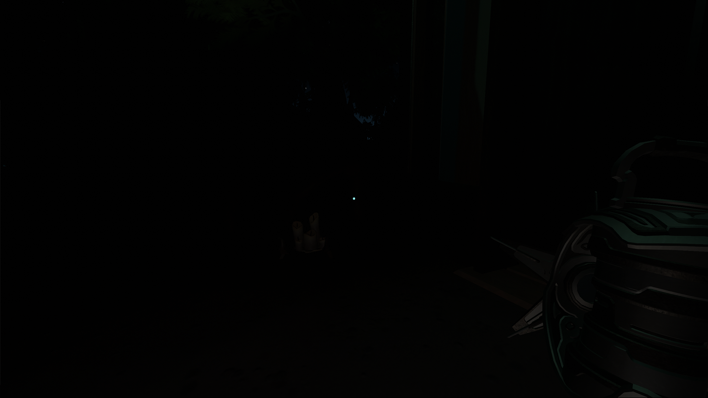
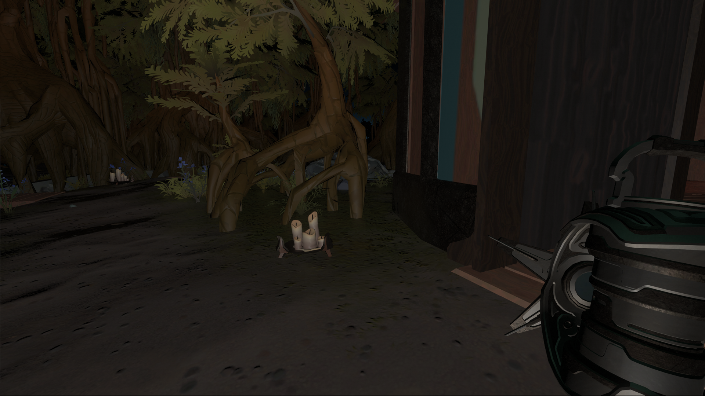

# Echoes of the Eye: Brighter Dreams mod

⚠️ **Potential spoilers ahead**

Gives the player night vision on Echoes of the Eye's dream world.

This mod can be viewed as an accessibility/help option for people with nyctaphobia and for those who find the DLC too difficult or scary.

You can adjust both the `range` and `intensity` of the night vision, so don't hesitate to tweak the settings to best suit your needs.

By default, the settings are left very low to preserve the original experience as much as possible, but it is just enough to see where you walk.

> ⚠️ **I strongly recommend playing with the default settings to enjoy the almost-vanilla experience.** Increase the settings, *gradually*, only if the game really makes you uncomfortable. Although it was not made for that purpose, this mod can allow you to cheat your way through the DLC if the settings are pushed too far.

## Settings
From the main/pause menu, go to `Mods` then `EotE Brighter Dreams`:

 - **Night vision range**: how far your vision goes in the dark *(default: 10)*
 - **Night vision intensity**: how well you can see in the dark *(default: 1)*

## Settings comparison

*Without the mod (vanilla)*

*Mod default settings (subtle night vision, recommended)*

*Mod max settings*
